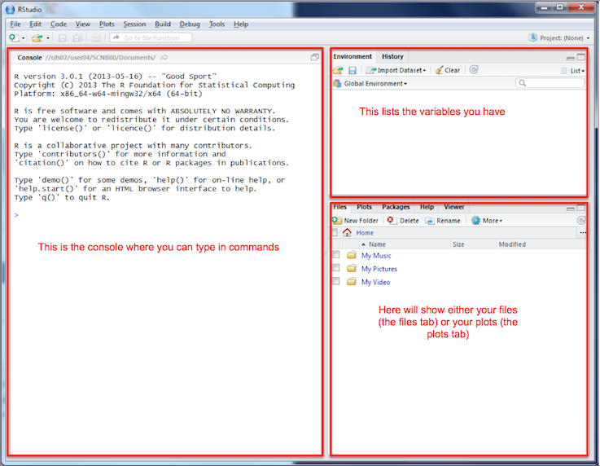

<!-- complied with pandoc -V geometry:margin=0.8in workbook.md -s -o workbook.pdf -->

#Introduction to Using PopChange Data with RStudio

*You can download a PDF of these instructions from: bit.ly/ClearMapBCS*

{ width=50% } 

This part of the practical shows you how to use the web resource to access the PopChange data and perform some basic comparisons of Census data between different years. To start:  

- Open up Chrome or Firefox   
- Navigate to _popchange.liverpool.ac.uk_   
- Click **Register**  
- Fill in the registration form  

{ width=35% }

*We ask for this information because the funders of the project (Economic and Social Research Council) want to know how many people use the resource and what type of work they do with it. We've tried to make it as simple as possible, but if you have any feedback, please let us know.*

- Click **Register**  
- Once you have registered, you will be taken back to the PopChange home page  
- To begin a comparison, login using the details you have just registered with  
- You will then see a screen similar to the one below:  

{ width=50% }

- This allows you to select an area and then select the year and data set you wish to compare  

*The menus are dynamic in that they will only show you the possible comparisons based on the selections you have made so far. They will also highlight whether the comparison you have selected is meaningful (highlighted in green) or whether caution is needed (highlighted in yellow). If caution is needed, further information will be provided.*  

- Select **1991** and **Age 30 - 44** as Set 1 and **1981** and **Age 30 - 44** as Set 2  
- Click **Generate**  
- The output will be displayed on a map on the right  
- This is a map you can move about and zoom in/out <!-- There is also a transparency slider at the top to allow you to see the basemap -->  

{ width=60% }

The results (as a PDF report, a GeoTIFF for use in QGIS, a PNG image file and various other formats) can be downloaded from the links on the left. 

You can see on the map where there have been high areas of increase (dark red) and high areas of decrease (blue). Try some different combinations of variables. 

- Which of these combinations are sensible?   
- Do the results seem realistic to you?  
- Which combinations should be used with caution? Why?   

You also have the option of limiting the map to a Local Authority of your choice (under the Area option) or excluding cells with a low population count (defined as <= 25 people). 

#Using PopChange data with RStudio

This section of the practical shows how to perform some basic analysis on the PopChange data using R and RStudio.  

The flexibility of R allows you to perform much more analysis than we show in this session, but we do not have enough time to cover every combination of things you could do with R! If you want to take this further in the future, check out Clear Mapping Co's upcoming training courses in R and Spatial Analysis. 

To begin with, we need to download the data from the website. I will use the 1991 and 1981 Age 30-34 years as an example, but you can use whichever data you like. 

- On the PopChange website click the **Data** tab  
- Click **Age**  
- Click **1991**  
- Right click on **5a_ascii_grid1991_Age_Age30_34.asc** and choose **Save link as...**  
- Save the file in your My Documents folder  
- Repeat the process for **5a_ascii_grid1981_Age30_34.asc** in the 1981 folder  

<!--  
```{r, message=FALSE, display=FALSE, comment=NA, warning=FALSE, results='hide'}
#add a section to check whether file exists already, as they are quite large downloads (4.5 mb each)
#currently automated download doesn't work thorough R

#download datasets from PopChange site
#download.file("https://popchange-data.liverpool.ac.uk/age/1981/5a_ascii_grid1991_Age_Age30_34.asc","5a_ascii_grid1991_Age_Age30_34.asc")
#download.file("https://popchange-data.liverpool.ac.uk/age/1981/5a_ascii_grid1981_Age_Age30_34.asc","5a_ascii_grid1981_Age_Age30_34.asc")
```
-->

We won't spend too much time on the very basics of using R - if you want to find out more, there are some good tutorials at http://www.social-statistics.org/?p=764 or http://rpubs.com/nickbearman/gettingstartedwithr. 

We are going to use a program called [RStudio](http://www.rstudio.com/ "R Studio website"), which works on top of R and provides a good user interface. I'll talk a little bit about it in the presentation, but the key areas of the window are these:



Open up R Studio (click **Start > All Programs > RStudio > RStudio** or double-click the icon on the desktop). 

R can do lots of different types of analysis and you can turn on extra set of commands by loading 'libraries' or 'packages'. We need to load a couple of spatial data related libraries. To do this, type these commands in to the console:

```{r,message=FALSE, display=FALSE, warning = FALSE}
library(raster)
library(rgdal)
```

*Remember: if you are using your own laptop, you will need to install the packages first, see the Installing R and RStudio for use with Spatial Data handout for details.*  

The next step is to read in the data. As with most programs, there are many different ways of completing a certain task. I am only going to show you one today - there are many others you might come across in the future!

```{r,message=FALSE,display=FALSE, warning = FALSE}
#any line starting with a # is a comment, and ignored by R. 
#We use it to record what we did for when we return to the 
#code in 6 months time and have no idea what it means!

#load popchange raster data in an R object called '1991Age3034'
Age3034_1991 <- raster("5a_ascii_grid1991_Age_Age30_34.asc")
```

We can simply plot the raster data:

```{r,message=FALSE,display=FALSE, warning = FALSE}
# plot data
plot(Age3034_1991)
```

*(R will sometimes struggle with large data sets using plot. If it does, try `image(Age3034_1991)` instead.)*

This will give us a simple map of the data. There are various different things we can do with the data. Work through the sections below at your own pace, and feel free to skip some if you like. 

##Raster Information & Histogram

We can view a range of information about the raster data:

```{r, message=FALSE, display = FALSE, warning = FALSE, results = 'hide'}
#calculate min and max values for raster
Age3034_1991 <- setMinMax(Age3034_1991)
#print out raster details
Age3034_1991
```

This will tell us how many cells there are (`ncell`) as well the maximum, minimum and a whole range of other information. 

We can also view the histogram of the raster with:

```{r, warning = FALSE}
#display basic histogram
hist(Age3034_1991)
```

Note the warning message. By default, R is not used to dealing with large data sets. We can add some parameters to the `hist()` function to show all the data, and tidy up the display a bit.  
  
```{r, eval = FALSE, message=FALSE, display = FALSE, warning = FALSE, results = 'hide'}
#display histogram, specifying title, colour and number of pixels
hist(Age3034_1991, main="Distribution of Age 30-34 in 1991 values", 
     col= "purple", maxpixels=800000)
```

As with many of these data sets, there are many 0 values. We can plot the histogram without the 0 values using the code below:

```{r, eval = FALSE, warning = FALSE}
#display histogram, specifying title and colour
hist(Age3034_1991[Age3034_1991!=0], main="Distribution of Age 30-34 in 1991 values, 
     without 0s",col= "purple")
```

##Changing the Symbology

Our basic plot is ok, but not very exciting or pretty:

```{r,message=FALSE,display=FALSE, warning = FALSE, eval=FALSE}
# plot data
plot(Age3034_1991)
```

There are various things we can do to improve this, such as removing the axes:

```{r,message=FALSE,display=FALSE, warning = FALSE, eval=FALSE}
# plot data
plot(Age3034_1991, axes = FALSE)
```

And customising the colours:

```{r,message=FALSE,display=FALSE, warning = FALSE, eval=FALSE}
#load library for colours (remember to install if you need to)
  library(RColorBrewer)
#set colours
  my_colours <- brewer.pal(6, "Blues")
#plot map
  plot(Age3034_1991, col=my_colours, main="Age 30 - 34 Count in 1991", axes = FALSE)
```

##Clipping out a Local Authority

It is probably better to show a smaller area rather than the whole of Great Britain. We can either select out by drawing on the map, or by selecting a Local Authority. To select out an area, run the code below as a block (highlight all 7 lines and click Run). Once the first map has appears, click the upper left and lower right corners of the box you want draw on the map. Then the zoomed in map will appear. 

```{r,message=FALSE,display=FALSE, warning = FALSE, eval=FALSE}
#plot the data
  plot(Age3034_1991, col=my_colours, axes = FALSE)
#Define the extent of the crop by clicking on the plot
  cropbox1 <- drawExtent()
#crop the raster, then plot the new cropped raster
  Age3034_1991_crop <- crop(Age3034_1991, cropbox1)
  plot(Age3034_1991_crop, col=my_colours, axes = FALSE)
```

If we want to crop the data by local authority, we need the local authority boundary. You can get some boundaries from bit.ly/ClearMapBCS, or you can use your own. Then you can crop the data using this code:

```{r,message=FALSE,display=FALSE, warning = FALSE, eval=FALSE}
#read in County Durham data
  la <- readOGR(dsn = "county-durham.geojson", layer = "OGRGeoJSON")
#clip out section required
  #see https://gis.stackexchange.com/questions/130522/increasing-speed-of-crop-mask-
  #extract-raster-by-many-polygons-in-r for info
  clip1 <- crop(Age3034_1991, extent(la))
  clip2 <- rasterize(la, clip1, mask=TRUE)
#plot just the LA boundary
  plot(la)
#overlay the data
  plot(clip2, col=my_colours, axes = FALSE, add = TRUE)
#replot the LA boundary
  plot(la, add = TRUE)
```

##Raster Calculator

We can also do the raster calculator process in R, i.e. calculating the difference between two years. 
  
```{r,message=FALSE,display=FALSE, warning = FALSE, eval=FALSE}
#load popchange raster data in an R object called '1991Age3034' and '1981Age3034'
  Age3034_1991 <- raster("5a_ascii_grid1991_Age_Age30_34.asc")
  Age3034_1981 <- raster("5a_ascii_grid1981_Age_Age30_34.asc")
#do the subtraction
  Age3034_difference <- Age3034_1991 - Age3034_1981
#plot the map
  plot(Age3034_difference, col=my_colours, axes = FALSE)
```

Try seeing if you can crop out an area from this data set. 

There is loads more you can do in RStudio! Have a look on the web, or sign up to hear about our training courses (nick@clearmapping.co.uk) if you are interested. 

    
-----------------------------------------------------------------------

This practical was supplied by Clear Mapping Co. 

*Clear Mapping Company is an award-winning international cartographic design consultancy. We create beautiful maps to improve efficiency in the workplace with an inclusive and sustainable design focus.*

*Our bespoke GIS training courses offer the opportunity to improve efficiency handling spatial data and creating clear maps.*

PopChange is funded by the Economic and Social Research Council (ESRC) under the Secondary Data Analysis Initiative (SDAI), Phase 2 (project ES/L014769/1) and this support is acknowledged gratefully. The Office for National Statistics are project partners. The research builds on the British Academy/Leverhulme Trust Small Research Grant Scheme funded project ‘Generating population surfaces for England and Wales using information on landuse and the spatial structure of population variables’ (SG121849), which ran from 2013 to 2014. The project is based with the University of Liverpool’s cross-disciplinary Centre for Spatial Demographics Research. For more information see: https://www.liverpool.ac.uk/geography-and-planning/research/popchange/introduction/

This practical was written using R 3.4.0 (2017-04-21) and RStudio 1.0.143 by Nick Bearman (nick@clearmapping.co.uk). This work is licensed under the Creative Commons Attribution-ShareAlike 4.0 International License. To view a copy of this license, visit http://creativecommons.org/licenses/by-sa/4.0/deed.en.  

The latest version of the PDF is available from https://github.com/ClearMappingCo/popchange-documentation.  